<!-- markdownlint-capture -->
<!-- markdownlint-disable -->

# Code Metrics

This file is dynamically maintained by a bot, *please do not* edit this by hand. It represents various [code metrics](https://aka.ms/dotnet/code-metrics), such as cyclomatic complexity, maintainability index, and so on.

<div id='myjetwallet-sdk-nosql'></div>

## MyJetWallet.Sdk.NoSql :exploding_head:

The *MyJetWallet.Sdk.NoSql.csproj* project file contains:

- 1 namespaces.
- 13 named types.
- 505 total lines of source code.
- Approximately 154 lines of executable code.
- The highest cyclomatic complexity is 15 :exploding_head:.

<details>
<summary>
  <strong id="myjetwallet-sdk-nosql">
    MyJetWallet.Sdk.NoSql :exploding_head:
  </strong>
</summary>
<br>

The `MyJetWallet.Sdk.NoSql` namespace contains 13 named types.

- 13 named types.
- 505 total lines of source code.
- Approximately 154 lines of executable code.
- The highest cyclomatic complexity is 15 :exploding_head:.

<details>
<summary>
  <strong id="autofacnosqlhelper">
    AutofacNoSqlHelper :heavy_check_mark:
  </strong>
</summary>
<br>

- The `AutofacNoSqlHelper` contains 5 members.
- 138 total lines of source code.
- Approximately 44 lines of executable code.
- The highest cyclomatic complexity is 3 :heavy_check_mark:.

| Member kind | Line number | Maintainability index | Cyclomatic complexity | Depth of inheritance | Class coupling | Lines of source / executable code |
| :-: | :-: | :-: | :-: | :-: | :-: | :-: |
| Method | <a href='https://github.com/MyJetWallet/MyJetWallet.Sdk.NoSql/blob/master/src/MyJetWallet.Sdk.NoSql/AutofacNoSqlHelper.cs#L46' title='IMyNoSqlSubscriber AutofacNoSqlHelper.CreateNoSqlClient(ContainerBuilder builder, string readerHostPort, ILoggerFactory loggerFactory, string nosqlClientName = "")'>46</a> | 57 | 3 :heavy_check_mark: | 0 | 7 | 51 / 17 |
| Method | <a href='https://github.com/MyJetWallet/MyJetWallet.Sdk.NoSql/blob/master/src/MyJetWallet.Sdk.NoSql/AutofacNoSqlHelper.cs#L14' title='IMyNoSqlSubscriber AutofacNoSqlHelper.CreateNoSqlClientOld(ContainerBuilder builder, Func<string> readerHostPort)'>14</a> | 66 | 2 :heavy_check_mark: | 0 | 7 | 31 / 9 |
| Method | <a href='https://github.com/MyJetWallet/MyJetWallet.Sdk.NoSql/blob/master/src/MyJetWallet.Sdk.NoSql/AutofacNoSqlHelper.cs#L112' title='IMyNoSqlServerDataReader<T> AutofacNoSqlHelper.RegisterMyNoSqlReader<T>(ContainerBuilder builder, IMyNoSqlSubscriber client, string tableName)'>112</a> | 84 | 1 :heavy_check_mark: | 0 | 4 | 6 / 2 |
| Method | <a href='https://github.com/MyJetWallet/MyJetWallet.Sdk.NoSql/blob/master/src/MyJetWallet.Sdk.NoSql/AutofacNoSqlHelper.cs#L119' title='IMyNoSqlServerDataReader<T> AutofacNoSqlHelper.RegisterMyNoSqlReader<T>(ContainerBuilder builder, IMyNoSqlSubscriber client, string tableName, NoSqlDataWaitMode waitDataOnStart)'>119</a> | 63 | 3 :heavy_check_mark: | 0 | 10 | 28 / 11 |
| Method | <a href='https://github.com/MyJetWallet/MyJetWallet.Sdk.NoSql/blob/master/src/MyJetWallet.Sdk.NoSql/AutofacNoSqlHelper.cs#L98' title='IMyNoSqlServerDataWriter<T> AutofacNoSqlHelper.RegisterMyNoSqlWriter<T>(ContainerBuilder builder, Func<string> writerUrl, string tableName, bool persist = true, DataSynchronizationPeriod dataSynchronizationPeriod = null)'>98</a> | 71 | 1 :heavy_check_mark: | 0 | 6 | 13 / 5 |

<a href="#AutofacNoSqlHelper-class-diagram">:link: to `AutofacNoSqlHelper` class diagram</a>

<a href="#myjetwallet-sdk-nosql">:top: back to MyJetWallet.Sdk.NoSql</a>

</details>

<details>
<summary>
  <strong id="mynosqlsubscriberlogwrapper-deleteactionswrappert">
    MyNoSqlSubscriberLogWrapper.DeleteActionsWrapper&lt;T&gt; :heavy_check_mark:
  </strong>
</summary>
<br>

- The `MyNoSqlSubscriberLogWrapper.DeleteActionsWrapper<T>` contains 6 members.
- 28 total lines of source code.
- Approximately 11 lines of executable code.
- The highest cyclomatic complexity is 3 :heavy_check_mark:.

| Member kind | Line number | Maintainability index | Cyclomatic complexity | Depth of inheritance | Class coupling | Lines of source / executable code |
| :-: | :-: | :-: | :-: | :-: | :-: | :-: |
| Field | <a href='https://github.com/MyJetWallet/MyJetWallet.Sdk.NoSql/blob/master/src/MyJetWallet.Sdk.NoSql/MyNoSqlSubscriberLogWrapper.cs#L122' title='Action<IEnumerable<(string partitionKey, string rowKey)>> DeleteActionsWrapper<T>._action'>122</a> | 100 | 0 :heavy_check_mark: | 0 | 3 | 1 / 0 |
| Field | <a href='https://github.com/MyJetWallet/MyJetWallet.Sdk.NoSql/blob/master/src/MyJetWallet.Sdk.NoSql/MyNoSqlSubscriberLogWrapper.cs#L120' title='string DeleteActionsWrapper<T>._name'>120</a> | 100 | 0 :heavy_check_mark: | 0 | 0 | 1 / 0 |
| Field | <a href='https://github.com/MyJetWallet/MyJetWallet.Sdk.NoSql/blob/master/src/MyJetWallet.Sdk.NoSql/MyNoSqlSubscriberLogWrapper.cs#L121' title='string DeleteActionsWrapper<T>._tableName'>121</a> | 100 | 0 :heavy_check_mark: | 0 | 0 | 1 / 0 |
| Method | <a href='https://github.com/MyJetWallet/MyJetWallet.Sdk.NoSql/blob/master/src/MyJetWallet.Sdk.NoSql/MyNoSqlSubscriberLogWrapper.cs#L124' title='DeleteActionsWrapper<T>.DeleteActionsWrapper(string name, string tableName, Action<IEnumerable<(string partitionKey, string rowKey)>> action)'>124</a> | 79 | 1 :heavy_check_mark: | 0 | 3 | 6 / 3 |
| Method | <a href='https://github.com/MyJetWallet/MyJetWallet.Sdk.NoSql/blob/master/src/MyJetWallet.Sdk.NoSql/MyNoSqlSubscriberLogWrapper.cs#L131' title='void DeleteActionsWrapper<T>.Action(IEnumerable<(string partitionKey, string rowKey)> items)'>131</a> | 68 | 3 :heavy_check_mark: | 0 | 5 | 12 / 7 |
| Property | <a href='https://github.com/MyJetWallet/MyJetWallet.Sdk.NoSql/blob/master/src/MyJetWallet.Sdk.NoSql/MyNoSqlSubscriberLogWrapper.cs#L118' title='bool DeleteActionsWrapper<T>.LogEnabled'>118</a> | 100 | 2 :heavy_check_mark: | 0 | 0 | 1 / 1 |

<a href="#MyNoSqlSubscriberLogWrapper.DeleteActionsWrapper&lt;T&gt;-class-diagram">:link: to `MyNoSqlSubscriberLogWrapper.DeleteActionsWrapper&lt;T&gt;` class diagram</a>

<a href="#myjetwallet-sdk-nosql">:top: back to MyJetWallet.Sdk.NoSql</a>

</details>

<details>
<summary>
  <strong id="imynosqltcpclientmanager">
    IMyNoSqlTcpClientManager :heavy_check_mark:
  </strong>
</summary>
<br>

- The `IMyNoSqlTcpClientManager` contains 2 members.
- 5 total lines of source code.
- Approximately 0 lines of executable code.
- The highest cyclomatic complexity is 1 :heavy_check_mark:.

| Member kind | Line number | Maintainability index | Cyclomatic complexity | Depth of inheritance | Class coupling | Lines of source / executable code |
| :-: | :-: | :-: | :-: | :-: | :-: | :-: |
| Method | <a href='https://github.com/MyJetWallet/MyJetWallet.Sdk.NoSql/blob/master/src/MyJetWallet.Sdk.NoSql/IMyNoSqlTcpClientManager.cs#L7' title='void IMyNoSqlTcpClientManager.Start()'>7</a> | 100 | 1 :heavy_check_mark: | 0 | 0 | 1 / 0 |
| Method | <a href='https://github.com/MyJetWallet/MyJetWallet.Sdk.NoSql/blob/master/src/MyJetWallet.Sdk.NoSql/IMyNoSqlTcpClientManager.cs#L8' title='void IMyNoSqlTcpClientManager.Stop()'>8</a> | 100 | 1 :heavy_check_mark: | 0 | 0 | 1 / 0 |

<a href="#IMyNoSqlTcpClientManager-class-diagram">:link: to `IMyNoSqlTcpClientManager` class diagram</a>

<a href="#myjetwallet-sdk-nosql">:top: back to MyJetWallet.Sdk.NoSql</a>

</details>

<details>
<summary>
  <strong id="mynosqlsubscriberlogwrapper-initactionwrappert">
    MyNoSqlSubscriberLogWrapper.InitActionWrapper&lt;T&gt; :heavy_check_mark:
  </strong>
</summary>
<br>

- The `MyNoSqlSubscriberLogWrapper.InitActionWrapper<T>` contains 5 members.
- 25 total lines of source code.
- Approximately 9 lines of executable code.
- The highest cyclomatic complexity is 1 :heavy_check_mark:.

| Member kind | Line number | Maintainability index | Cyclomatic complexity | Depth of inheritance | Class coupling | Lines of source / executable code |
| :-: | :-: | :-: | :-: | :-: | :-: | :-: |
| Field | <a href='https://github.com/MyJetWallet/MyJetWallet.Sdk.NoSql/blob/master/src/MyJetWallet.Sdk.NoSql/MyNoSqlSubscriberLogWrapper.cs#L39' title='Action<IReadOnlyList<T>> InitActionWrapper<T>._initAction'>39</a> | 100 | 0 :heavy_check_mark: | 0 | 2 | 1 / 0 |
| Field | <a href='https://github.com/MyJetWallet/MyJetWallet.Sdk.NoSql/blob/master/src/MyJetWallet.Sdk.NoSql/MyNoSqlSubscriberLogWrapper.cs#L37' title='string InitActionWrapper<T>._name'>37</a> | 100 | 0 :heavy_check_mark: | 0 | 0 | 1 / 0 |
| Field | <a href='https://github.com/MyJetWallet/MyJetWallet.Sdk.NoSql/blob/master/src/MyJetWallet.Sdk.NoSql/MyNoSqlSubscriberLogWrapper.cs#L38' title='string InitActionWrapper<T>._tableName'>38</a> | 100 | 0 :heavy_check_mark: | 0 | 0 | 1 / 0 |
| Method | <a href='https://github.com/MyJetWallet/MyJetWallet.Sdk.NoSql/blob/master/src/MyJetWallet.Sdk.NoSql/MyNoSqlSubscriberLogWrapper.cs#L41' title='InitActionWrapper<T>.InitActionWrapper(string name, string tableName, Action<IReadOnlyList<T>> initAction)'>41</a> | 79 | 1 :heavy_check_mark: | 0 | 2 | 6 / 3 |
| Method | <a href='https://github.com/MyJetWallet/MyJetWallet.Sdk.NoSql/blob/master/src/MyJetWallet.Sdk.NoSql/MyNoSqlSubscriberLogWrapper.cs#L48' title='void InitActionWrapper<T>.Action(IReadOnlyList<T> items)'>48</a> | 71 | 1 :heavy_check_mark: | 0 | 4 | 11 / 6 |

<a href="#MyNoSqlSubscriberLogWrapper.InitActionWrapper&lt;T&gt;-class-diagram">:link: to `MyNoSqlSubscriberLogWrapper.InitActionWrapper&lt;T&gt;` class diagram</a>

<a href="#myjetwallet-sdk-nosql">:top: back to MyJetWallet.Sdk.NoSql</a>

</details>

<details>
<summary>
  <strong id="mynosqlsubscriberlogwrapper-initpartitionactionwrappert">
    MyNoSqlSubscriberLogWrapper.InitPartitionActionWrapper&lt;T&gt; :heavy_check_mark:
  </strong>
</summary>
<br>

- The `MyNoSqlSubscriberLogWrapper.InitPartitionActionWrapper<T>` contains 5 members.
- 25 total lines of source code.
- Approximately 9 lines of executable code.
- The highest cyclomatic complexity is 1 :heavy_check_mark:.

| Member kind | Line number | Maintainability index | Cyclomatic complexity | Depth of inheritance | Class coupling | Lines of source / executable code |
| :-: | :-: | :-: | :-: | :-: | :-: | :-: |
| Field | <a href='https://github.com/MyJetWallet/MyJetWallet.Sdk.NoSql/blob/master/src/MyJetWallet.Sdk.NoSql/MyNoSqlSubscriberLogWrapper.cs#L65' title='Action<string, IReadOnlyList<T>> InitPartitionActionWrapper<T>._action'>65</a> | 100 | 0 :heavy_check_mark: | 0 | 2 | 1 / 0 |
| Field | <a href='https://github.com/MyJetWallet/MyJetWallet.Sdk.NoSql/blob/master/src/MyJetWallet.Sdk.NoSql/MyNoSqlSubscriberLogWrapper.cs#L63' title='string InitPartitionActionWrapper<T>._name'>63</a> | 100 | 0 :heavy_check_mark: | 0 | 0 | 1 / 0 |
| Field | <a href='https://github.com/MyJetWallet/MyJetWallet.Sdk.NoSql/blob/master/src/MyJetWallet.Sdk.NoSql/MyNoSqlSubscriberLogWrapper.cs#L64' title='string InitPartitionActionWrapper<T>._tableName'>64</a> | 100 | 0 :heavy_check_mark: | 0 | 0 | 1 / 0 |
| Method | <a href='https://github.com/MyJetWallet/MyJetWallet.Sdk.NoSql/blob/master/src/MyJetWallet.Sdk.NoSql/MyNoSqlSubscriberLogWrapper.cs#L67' title='InitPartitionActionWrapper<T>.InitPartitionActionWrapper(string name, string tableName, Action<string, IReadOnlyList<T>> action)'>67</a> | 79 | 1 :heavy_check_mark: | 0 | 2 | 6 / 3 |
| Method | <a href='https://github.com/MyJetWallet/MyJetWallet.Sdk.NoSql/blob/master/src/MyJetWallet.Sdk.NoSql/MyNoSqlSubscriberLogWrapper.cs#L74' title='void InitPartitionActionWrapper<T>.Action(string pk, IReadOnlyList<T> items)'>74</a> | 71 | 1 :heavy_check_mark: | 0 | 4 | 11 / 6 |

<a href="#MyNoSqlSubscriberLogWrapper.InitPartitionActionWrapper&lt;T&gt;-class-diagram">:link: to `MyNoSqlSubscriberLogWrapper.InitPartitionActionWrapper&lt;T&gt;` class diagram</a>

<a href="#myjetwallet-sdk-nosql">:top: back to MyJetWallet.Sdk.NoSql</a>

</details>

<details>
<summary>
  <strong id="inosqlreadercountdatagetter">
    INoSqlReaderCountDataGetter :heavy_check_mark:
  </strong>
</summary>
<br>

- The `INoSqlReaderCountDataGetter` contains 1 members.
- 4 total lines of source code.
- Approximately 0 lines of executable code.
- The highest cyclomatic complexity is 1 :heavy_check_mark:.

| Member kind | Line number | Maintainability index | Cyclomatic complexity | Depth of inheritance | Class coupling | Lines of source / executable code |
| :-: | :-: | :-: | :-: | :-: | :-: | :-: |
| Method | <a href='https://github.com/MyJetWallet/MyJetWallet.Sdk.NoSql/blob/master/src/MyJetWallet.Sdk.NoSql/NoSqlReaderCountDataGetter.cs#L7' title='(int, string, NoSqlDataWaitMode) INoSqlReaderCountDataGetter.CountEntities()'>7</a> | 100 | 1 :heavy_check_mark: | 0 | 2 | 1 / 0 |

<a href="#INoSqlReaderCountDataGetter-class-diagram">:link: to `INoSqlReaderCountDataGetter` class diagram</a>

<a href="#myjetwallet-sdk-nosql">:top: back to MyJetWallet.Sdk.NoSql</a>

</details>

<details>
<summary>
  <strong id="mynosqlclientlifetime">
    MyNoSqlClientLifeTime :exploding_head:
  </strong>
</summary>
<br>

- The `MyNoSqlClientLifeTime` contains 7 members.
- 93 total lines of source code.
- Approximately 36 lines of executable code.
- The highest cyclomatic complexity is 15 :exploding_head:.

| Member kind | Line number | Maintainability index | Cyclomatic complexity | Depth of inheritance | Class coupling | Lines of source / executable code |
| :-: | :-: | :-: | :-: | :-: | :-: | :-: |
| Field | <a href='https://github.com/MyJetWallet/MyJetWallet.Sdk.NoSql/blob/master/src/MyJetWallet.Sdk.NoSql/MyNoSqlClientLifeTime.cs#L12' title='IMyNoSqlTcpClientManager[] MyNoSqlClientLifeTime._clients'>12</a> | 100 | 0 :heavy_check_mark: | 0 | 0 | 1 / 0 |
| Field | <a href='https://github.com/MyJetWallet/MyJetWallet.Sdk.NoSql/blob/master/src/MyJetWallet.Sdk.NoSql/MyNoSqlClientLifeTime.cs#L13' title='INoSqlReaderCountDataGetter[] MyNoSqlClientLifeTime._countDataGetter'>13</a> | 100 | 0 :heavy_check_mark: | 0 | 0 | 1 / 0 |
| Field | <a href='https://github.com/MyJetWallet/MyJetWallet.Sdk.NoSql/blob/master/src/MyJetWallet.Sdk.NoSql/MyNoSqlClientLifeTime.cs#L14' title='ILogger<MyNoSqlClientLifeTime> MyNoSqlClientLifeTime._logger'>14</a> | 100 | 0 :heavy_check_mark: | 0 | 1 | 1 / 0 |
| Field | <a href='https://github.com/MyJetWallet/MyJetWallet.Sdk.NoSql/blob/master/src/MyJetWallet.Sdk.NoSql/MyNoSqlClientLifeTime.cs#L15' title='MyNoSqlTcpClientWatcher MyNoSqlClientLifeTime._watcher'>15</a> | 100 | 0 :heavy_check_mark: | 0 | 1 | 1 / 0 |
| Method | <a href='https://github.com/MyJetWallet/MyJetWallet.Sdk.NoSql/blob/master/src/MyJetWallet.Sdk.NoSql/MyNoSqlClientLifeTime.cs#L17' title='MyNoSqlClientLifeTime.MyNoSqlClientLifeTime(IMyNoSqlTcpClientManager[] clients, INoSqlReaderCountDataGetter[] countDataGetter, ILogger<MyNoSqlClientLifeTime> logger, MyNoSqlTcpClientWatcher watcher)'>17</a> | 75 | 1 :heavy_check_mark: | 0 | 4 | 11 / 4 |
| Method | <a href='https://github.com/MyJetWallet/MyJetWallet.Sdk.NoSql/blob/master/src/MyJetWallet.Sdk.NoSql/MyNoSqlClientLifeTime.cs#L29' title='void MyNoSqlClientLifeTime.Start()'>29</a> | 48 | 15 :exploding_head: | 0 | 9 | 58 / 28 |
| Method | <a href='https://github.com/MyJetWallet/MyJetWallet.Sdk.NoSql/blob/master/src/MyJetWallet.Sdk.NoSql/MyNoSqlClientLifeTime.cs#L88' title='void MyNoSqlClientLifeTime.Stop()'>88</a> | 80 | 2 :heavy_check_mark: | 0 | 3 | 14 / 4 |

<a href="#MyNoSqlClientLifeTime-class-diagram">:link: to `MyNoSqlClientLifeTime` class diagram</a>

<a href="#myjetwallet-sdk-nosql">:top: back to MyJetWallet.Sdk.NoSql</a>

</details>

<details>
<summary>
  <strong id="mynosqlsubscriberlogwrapper">
    MyNoSqlSubscriberLogWrapper :heavy_check_mark:
  </strong>
</summary>
<br>

- The `MyNoSqlSubscriberLogWrapper` contains 4 members.
- 136 total lines of source code.
- Approximately 8 lines of executable code.
- The highest cyclomatic complexity is 1 :heavy_check_mark:.

| Member kind | Line number | Maintainability index | Cyclomatic complexity | Depth of inheritance | Class coupling | Lines of source / executable code |
| :-: | :-: | :-: | :-: | :-: | :-: | :-: |
| Field | <a href='https://github.com/MyJetWallet/MyJetWallet.Sdk.NoSql/blob/master/src/MyJetWallet.Sdk.NoSql/MyNoSqlSubscriberLogWrapper.cs#L11' title='IMyNoSqlSubscriber MyNoSqlSubscriberLogWrapper._client'>11</a> | 100 | 0 :heavy_check_mark: | 0 | 1 | 1 / 0 |
| Field | <a href='https://github.com/MyJetWallet/MyJetWallet.Sdk.NoSql/blob/master/src/MyJetWallet.Sdk.NoSql/MyNoSqlSubscriberLogWrapper.cs#L12' title='string MyNoSqlSubscriberLogWrapper._name'>12</a> | 100 | 0 :heavy_check_mark: | 0 | 0 | 1 / 0 |
| Method | <a href='https://github.com/MyJetWallet/MyJetWallet.Sdk.NoSql/blob/master/src/MyJetWallet.Sdk.NoSql/MyNoSqlSubscriberLogWrapper.cs#L14' title='MyNoSqlSubscriberLogWrapper.MyNoSqlSubscriberLogWrapper(IMyNoSqlSubscriber client, string name)'>14</a> | 85 | 1 :heavy_check_mark: | 0 | 1 | 5 / 2 |
| Method | <a href='https://github.com/MyJetWallet/MyJetWallet.Sdk.NoSql/blob/master/src/MyJetWallet.Sdk.NoSql/MyNoSqlSubscriberLogWrapper.cs#L20' title='void MyNoSqlSubscriberLogWrapper.Subscribe<T>(string tableName, Action<IReadOnlyList<T>> initAction, Action<string, IReadOnlyList<T>> initPartitionAction, Action<IReadOnlyList<T>> updateAction, Action<IEnumerable<(string partitionKey, string rowKey)>> deleteActions)'>20</a> | 67 | 1 :heavy_check_mark: | 0 | 11 | 14 / 6 |

<a href="#MyNoSqlSubscriberLogWrapper-class-diagram">:link: to `MyNoSqlSubscriberLogWrapper` class diagram</a>

<a href="#myjetwallet-sdk-nosql">:top: back to MyJetWallet.Sdk.NoSql</a>

</details>

<details>
<summary>
  <strong id="mynosqltcpclientmanager">
    MyNoSqlTcpClientManager :heavy_check_mark:
  </strong>
</summary>
<br>

- The `MyNoSqlTcpClientManager` contains 4 members.
- 19 total lines of source code.
- Approximately 3 lines of executable code.
- The highest cyclomatic complexity is 1 :heavy_check_mark:.

| Member kind | Line number | Maintainability index | Cyclomatic complexity | Depth of inheritance | Class coupling | Lines of source / executable code |
| :-: | :-: | :-: | :-: | :-: | :-: | :-: |
| Field | <a href='https://github.com/MyJetWallet/MyJetWallet.Sdk.NoSql/blob/master/src/MyJetWallet.Sdk.NoSql/IMyNoSqlTcpClientManager.cs#L13' title='MyNoSqlTcpClient MyNoSqlTcpClientManager._client'>13</a> | 100 | 0 :heavy_check_mark: | 0 | 1 | 1 / 0 |
| Method | <a href='https://github.com/MyJetWallet/MyJetWallet.Sdk.NoSql/blob/master/src/MyJetWallet.Sdk.NoSql/IMyNoSqlTcpClientManager.cs#L15' title='MyNoSqlTcpClientManager.MyNoSqlTcpClientManager(MyNoSqlTcpClient client)'>15</a> | 96 | 1 :heavy_check_mark: | 0 | 1 | 4 / 1 |
| Method | <a href='https://github.com/MyJetWallet/MyJetWallet.Sdk.NoSql/blob/master/src/MyJetWallet.Sdk.NoSql/IMyNoSqlTcpClientManager.cs#L20' title='void MyNoSqlTcpClientManager.Start()'>20</a> | 100 | 1 :heavy_check_mark: | 0 | 2 | 4 / 1 |
| Method | <a href='https://github.com/MyJetWallet/MyJetWallet.Sdk.NoSql/blob/master/src/MyJetWallet.Sdk.NoSql/IMyNoSqlTcpClientManager.cs#L25' title='void MyNoSqlTcpClientManager.Stop()'>25</a> | 100 | 1 :heavy_check_mark: | 0 | 2 | 4 / 1 |

<a href="#MyNoSqlTcpClientManager-class-diagram">:link: to `MyNoSqlTcpClientManager` class diagram</a>

<a href="#myjetwallet-sdk-nosql">:top: back to MyJetWallet.Sdk.NoSql</a>

</details>

<details>
<summary>
  <strong id="mynosqltcpclientwatcher">
    MyNoSqlTcpClientWatcher :heavy_check_mark:
  </strong>
</summary>
<br>

- The `MyNoSqlTcpClientWatcher` contains 10 members.
- 66 total lines of source code.
- Approximately 19 lines of executable code.
- The highest cyclomatic complexity is 4 :heavy_check_mark:.

| Member kind | Line number | Maintainability index | Cyclomatic complexity | Depth of inheritance | Class coupling | Lines of source / executable code |
| :-: | :-: | :-: | :-: | :-: | :-: | :-: |
| Field | <a href='https://github.com/MyJetWallet/MyJetWallet.Sdk.NoSql/blob/master/src/MyJetWallet.Sdk.NoSql/MyNoSqlTcpClientWatcher.cs#L19' title='DateTime? MyNoSqlTcpClientWatcher._lastLossConnect'>19</a> | 93 | 0 :heavy_check_mark: | 0 | 2 | 1 / 1 |
| Field | <a href='https://github.com/MyJetWallet/MyJetWallet.Sdk.NoSql/blob/master/src/MyJetWallet.Sdk.NoSql/MyNoSqlTcpClientWatcher.cs#L15' title='ILogger<MyNoSqlTcpClientWatcher> MyNoSqlTcpClientWatcher._logger'>15</a> | 100 | 0 :heavy_check_mark: | 0 | 1 | 1 / 0 |
| Field | <a href='https://github.com/MyJetWallet/MyJetWallet.Sdk.NoSql/blob/master/src/MyJetWallet.Sdk.NoSql/MyNoSqlTcpClientWatcher.cs#L14' title='MyNoSqlTcpClient MyNoSqlTcpClientWatcher._myNoSqlTcpClient'>14</a> | 100 | 0 :heavy_check_mark: | 0 | 1 | 1 / 0 |
| Field | <a href='https://github.com/MyJetWallet/MyJetWallet.Sdk.NoSql/blob/master/src/MyJetWallet.Sdk.NoSql/MyNoSqlTcpClientWatcher.cs#L17' title='DateTime MyNoSqlTcpClientWatcher._starTime'>17</a> | 100 | 0 :heavy_check_mark: | 0 | 1 | 1 / 0 |
| Field | <a href='https://github.com/MyJetWallet/MyJetWallet.Sdk.NoSql/blob/master/src/MyJetWallet.Sdk.NoSql/MyNoSqlTcpClientWatcher.cs#L16' title='MyTaskTimer MyNoSqlTcpClientWatcher._timer'>16</a> | 100 | 0 :heavy_check_mark: | 0 | 1 | 1 / 0 |
| Method | <a href='https://github.com/MyJetWallet/MyJetWallet.Sdk.NoSql/blob/master/src/MyJetWallet.Sdk.NoSql/MyNoSqlTcpClientWatcher.cs#L21' title='MyNoSqlTcpClientWatcher.MyNoSqlTcpClientWatcher(MyNoSqlTcpClient myNoSqlTcpClient, ILogger<MyNoSqlTcpClientWatcher> logger)'>21</a> | 78 | 1 :heavy_check_mark: | 0 | 4 | 7 / 3 |
| Method | <a href='https://github.com/MyJetWallet/MyJetWallet.Sdk.NoSql/blob/master/src/MyJetWallet.Sdk.NoSql/MyNoSqlTcpClientWatcher.cs#L54' title='void MyNoSqlTcpClientWatcher.Dispose()'>54</a> | 93 | 1 :heavy_check_mark: | 0 | 2 | 5 / 2 |
| Method | <a href='https://github.com/MyJetWallet/MyJetWallet.Sdk.NoSql/blob/master/src/MyJetWallet.Sdk.NoSql/MyNoSqlTcpClientWatcher.cs#L60' title='(string, List<string>) MyNoSqlTcpClientWatcher.GetIssues()'>60</a> | 70 | 4 :heavy_check_mark: | 0 | 5 | 17 / 5 |
| Method | <a href='https://github.com/MyJetWallet/MyJetWallet.Sdk.NoSql/blob/master/src/MyJetWallet.Sdk.NoSql/MyNoSqlTcpClientWatcher.cs#L29' title='void MyNoSqlTcpClientWatcher.Start()'>29</a> | 88 | 1 :heavy_check_mark: | 0 | 3 | 5 / 2 |
| Method | <a href='https://github.com/MyJetWallet/MyJetWallet.Sdk.NoSql/blob/master/src/MyJetWallet.Sdk.NoSql/MyNoSqlTcpClientWatcher.cs#L35' title='Task MyNoSqlTcpClientWatcher.Watch()'>35</a> | 70 | 3 :heavy_check_mark: | 0 | 6 | 18 / 6 |

<a href="#MyNoSqlTcpClientWatcher-class-diagram">:link: to `MyNoSqlTcpClientWatcher` class diagram</a>

<a href="#myjetwallet-sdk-nosql">:top: back to MyJetWallet.Sdk.NoSql</a>

</details>

<details>
<summary>
  <strong id="nosqldatawaitmode">
    NoSqlDataWaitMode :heavy_check_mark:
  </strong>
</summary>
<br>

- The `NoSqlDataWaitMode` contains 3 members.
- 6 total lines of source code.
- Approximately 0 lines of executable code.
- The highest cyclomatic complexity is 0 :heavy_check_mark:.

| Member kind | Line number | Maintainability index | Cyclomatic complexity | Depth of inheritance | Class coupling | Lines of source / executable code |
| :-: | :-: | :-: | :-: | :-: | :-: | :-: |
| Field | <a href='https://github.com/MyJetWallet/MyJetWallet.Sdk.NoSql/blob/master/src/MyJetWallet.Sdk.NoSql/NoSqlReaderCountDataGetter.cs#L12' title='NoSqlDataWaitMode.None'>12</a> | 100 | 0 :heavy_check_mark: | 0 | 0 | 1 / 0 |
| Field | <a href='https://github.com/MyJetWallet/MyJetWallet.Sdk.NoSql/blob/master/src/MyJetWallet.Sdk.NoSql/NoSqlReaderCountDataGetter.cs#L13' title='NoSqlDataWaitMode.WaitAndContinue'>13</a> | 100 | 0 :heavy_check_mark: | 0 | 0 | 1 / 0 |
| Field | <a href='https://github.com/MyJetWallet/MyJetWallet.Sdk.NoSql/blob/master/src/MyJetWallet.Sdk.NoSql/NoSqlReaderCountDataGetter.cs#L14' title='NoSqlDataWaitMode.WaitAndThrow'>14</a> | 100 | 0 :heavy_check_mark: | 0 | 0 | 1 / 0 |

<a href="#NoSqlDataWaitMode-class-diagram">:link: to `NoSqlDataWaitMode` class diagram</a>

<a href="#myjetwallet-sdk-nosql">:top: back to MyJetWallet.Sdk.NoSql</a>

</details>

<details>
<summary>
  <strong id="nosqlreadercountdatagetter">
    NoSqlReaderCountDataGetter :heavy_check_mark:
  </strong>
</summary>
<br>

- The `NoSqlReaderCountDataGetter` contains 5 members.
- 18 total lines of source code.
- Approximately 4 lines of executable code.
- The highest cyclomatic complexity is 2 :heavy_check_mark:.

| Member kind | Line number | Maintainability index | Cyclomatic complexity | Depth of inheritance | Class coupling | Lines of source / executable code |
| :-: | :-: | :-: | :-: | :-: | :-: | :-: |
| Field | <a href='https://github.com/MyJetWallet/MyJetWallet.Sdk.NoSql/blob/master/src/MyJetWallet.Sdk.NoSql/NoSqlReaderCountDataGetter.cs#L19' title='Func<int> NoSqlReaderCountDataGetter._countCallback'>19</a> | 100 | 0 :heavy_check_mark: | 0 | 1 | 1 / 0 |
| Field | <a href='https://github.com/MyJetWallet/MyJetWallet.Sdk.NoSql/blob/master/src/MyJetWallet.Sdk.NoSql/NoSqlReaderCountDataGetter.cs#L21' title='NoSqlDataWaitMode NoSqlReaderCountDataGetter._mode'>21</a> | 100 | 0 :heavy_check_mark: | 0 | 1 | 1 / 0 |
| Field | <a href='https://github.com/MyJetWallet/MyJetWallet.Sdk.NoSql/blob/master/src/MyJetWallet.Sdk.NoSql/NoSqlReaderCountDataGetter.cs#L20' title='string NoSqlReaderCountDataGetter._typeName'>20</a> | 100 | 0 :heavy_check_mark: | 0 | 0 | 1 / 0 |
| Method | <a href='https://github.com/MyJetWallet/MyJetWallet.Sdk.NoSql/blob/master/src/MyJetWallet.Sdk.NoSql/NoSqlReaderCountDataGetter.cs#L23' title='NoSqlReaderCountDataGetter.NoSqlReaderCountDataGetter(Func<int> countCallback, string typeName, NoSqlDataWaitMode mode)'>23</a> | 77 | 2 :heavy_check_mark: | 0 | 5 | 6 / 3 |
| Method | <a href='https://github.com/MyJetWallet/MyJetWallet.Sdk.NoSql/blob/master/src/MyJetWallet.Sdk.NoSql/NoSqlReaderCountDataGetter.cs#L30' title='(int, string, NoSqlDataWaitMode) NoSqlReaderCountDataGetter.CountEntities()'>30</a> | 92 | 1 :heavy_check_mark: | 0 | 4 | 4 / 1 |

<a href="#NoSqlReaderCountDataGetter-class-diagram">:link: to `NoSqlReaderCountDataGetter` class diagram</a>

<a href="#myjetwallet-sdk-nosql">:top: back to MyJetWallet.Sdk.NoSql</a>

</details>

<details>
<summary>
  <strong id="mynosqlsubscriberlogwrapper-updateactionwrappert">
    MyNoSqlSubscriberLogWrapper.UpdateActionWrapper&lt;T&gt; :heavy_check_mark:
  </strong>
</summary>
<br>

- The `MyNoSqlSubscriberLogWrapper.UpdateActionWrapper<T>` contains 7 members.
- 28 total lines of source code.
- Approximately 11 lines of executable code.
- The highest cyclomatic complexity is 3 :heavy_check_mark:.

| Member kind | Line number | Maintainability index | Cyclomatic complexity | Depth of inheritance | Class coupling | Lines of source / executable code |
| :-: | :-: | :-: | :-: | :-: | :-: | :-: |
| Field | <a href='https://github.com/MyJetWallet/MyJetWallet.Sdk.NoSql/blob/master/src/MyJetWallet.Sdk.NoSql/MyNoSqlSubscriberLogWrapper.cs#L94' title='Action<IReadOnlyList<T>> UpdateActionWrapper<T>._action'>94</a> | 100 | 0 :heavy_check_mark: | 0 | 2 | 1 / 0 |
| Field | <a href='https://github.com/MyJetWallet/MyJetWallet.Sdk.NoSql/blob/master/src/MyJetWallet.Sdk.NoSql/MyNoSqlSubscriberLogWrapper.cs#L92' title='string UpdateActionWrapper<T>._name'>92</a> | 100 | 0 :heavy_check_mark: | 0 | 0 | 1 / 0 |
| Field | <a href='https://github.com/MyJetWallet/MyJetWallet.Sdk.NoSql/blob/master/src/MyJetWallet.Sdk.NoSql/MyNoSqlSubscriberLogWrapper.cs#L93' title='string UpdateActionWrapper<T>._tableName'>93</a> | 100 | 0 :heavy_check_mark: | 0 | 0 | 1 / 0 |
| Method | <a href='https://github.com/MyJetWallet/MyJetWallet.Sdk.NoSql/blob/master/src/MyJetWallet.Sdk.NoSql/MyNoSqlSubscriberLogWrapper.cs#L96' title='UpdateActionWrapper<T>.UpdateActionWrapper(string name, string tableName, Action<IReadOnlyList<T>> action)'>96</a> | 79 | 1 :heavy_check_mark: | 0 | 2 | 6 / 3 |
| Method | <a href='https://github.com/MyJetWallet/MyJetWallet.Sdk.NoSql/blob/master/src/MyJetWallet.Sdk.NoSql/MyNoSqlSubscriberLogWrapper.cs#L103' title='void UpdateActionWrapper<T>.Action(IReadOnlyList<T> items)'>103</a> | 70 | 3 :heavy_check_mark: | 0 | 4 | 11 / 6 |
| Property | <a href='https://github.com/MyJetWallet/MyJetWallet.Sdk.NoSql/blob/master/src/MyJetWallet.Sdk.NoSql/MyNoSqlSubscriberLogWrapper.cs#L89' title='bool UpdateActionWrapper<T>.LogStartEnabled'>89</a> | 100 | 2 :heavy_check_mark: | 0 | 0 | 1 / 1 |
| Property | <a href='https://github.com/MyJetWallet/MyJetWallet.Sdk.NoSql/blob/master/src/MyJetWallet.Sdk.NoSql/MyNoSqlSubscriberLogWrapper.cs#L90' title='bool UpdateActionWrapper<T>.LogStopEnabled'>90</a> | 100 | 2 :heavy_check_mark: | 0 | 0 | 1 / 1 |

<a href="#MyNoSqlSubscriberLogWrapper.UpdateActionWrapper&lt;T&gt;-class-diagram">:link: to `MyNoSqlSubscriberLogWrapper.UpdateActionWrapper&lt;T&gt;` class diagram</a>

<a href="#myjetwallet-sdk-nosql">:top: back to MyJetWallet.Sdk.NoSql</a>

</details>

</details>

<a href="#myjetwallet-sdk-nosql">:top: back to MyJetWallet.Sdk.NoSql</a>

<div id='testapp'></div>

## TestApp :heavy_check_mark:

The *TestApp.csproj* project file contains:

- 1 namespaces.
- 2 named types.
- 83 total lines of source code.
- Approximately 43 lines of executable code.
- The highest cyclomatic complexity is 2 :heavy_check_mark:.

<details>
<summary>
  <strong id="testapp">
    TestApp :heavy_check_mark:
  </strong>
</summary>
<br>

The `TestApp` namespace contains 2 named types.

- 2 named types.
- 83 total lines of source code.
- Approximately 43 lines of executable code.
- The highest cyclomatic complexity is 2 :heavy_check_mark:.

<details>
<summary>
  <strong id="program">
    Program :heavy_check_mark:
  </strong>
</summary>
<br>

- The `Program` contains 2 members.
- 58 total lines of source code.
- Approximately 39 lines of executable code.
- The highest cyclomatic complexity is 2 :heavy_check_mark:.

| Member kind | Line number | Maintainability index | Cyclomatic complexity | Depth of inheritance | Class coupling | Lines of source / executable code |
| :-: | :-: | :-: | :-: | :-: | :-: | :-: |
| Method | <a href='https://github.com/MyJetWallet/MyJetWallet.Sdk.NoSql/blob/master/src/TestApp/Program.cs#L10' title='Task Program.Main(string[] args)'>10</a> | 47 | 1 :heavy_check_mark: | 0 | 4 | 46 / 36 |
| Method | <a href='https://github.com/MyJetWallet/MyJetWallet.Sdk.NoSql/blob/master/src/TestApp/Program.cs#L57' title='Task Program.Print(MyNoSqlServerDataWriter<TestEntity> writer)'>57</a> | 82 | 2 :heavy_check_mark: | 0 | 5 | 8 / 3 |

<a href="#Program-class-diagram">:link: to `Program` class diagram</a>

<a href="#testapp">:top: back to TestApp</a>

</details>

<details>
<summary>
  <strong id="testentity">
    TestEntity :heavy_check_mark:
  </strong>
</summary>
<br>

- The `TestEntity` contains 5 members.
- 21 total lines of source code.
- Approximately 4 lines of executable code.
- The highest cyclomatic complexity is 2 :heavy_check_mark:.

| Member kind | Line number | Maintainability index | Cyclomatic complexity | Depth of inheritance | Class coupling | Lines of source / executable code |
| :-: | :-: | :-: | :-: | :-: | :-: | :-: |
| Method | <a href='https://github.com/MyJetWallet/MyJetWallet.Sdk.NoSql/blob/master/src/TestApp/Program.cs#L77' title='TestEntity TestEntity.Create(string pk, string rk)'>77</a> | 89 | 1 :heavy_check_mark: | 0 | 1 | 9 / 1 |
| Method | <a href='https://github.com/MyJetWallet/MyJetWallet.Sdk.NoSql/blob/master/src/TestApp/Program.cs#L71' title='string TestEntity.GeneratePartitionKey(string pk)'>71</a> | 100 | 1 :heavy_check_mark: | 0 | 0 | 1 / 1 |
| Method | <a href='https://github.com/MyJetWallet/MyJetWallet.Sdk.NoSql/blob/master/src/TestApp/Program.cs#L72' title='string TestEntity.GenerateRowKey(string rk)'>72</a> | 100 | 1 :heavy_check_mark: | 0 | 0 | 1 / 1 |
| Property | <a href='https://github.com/MyJetWallet/MyJetWallet.Sdk.NoSql/blob/master/src/TestApp/Program.cs#L74' title='string TestEntity.Message'>74</a> | 100 | 2 :heavy_check_mark: | 0 | 0 | 1 / 0 |
| Field | <a href='https://github.com/MyJetWallet/MyJetWallet.Sdk.NoSql/blob/master/src/TestApp/Program.cs#L69' title='string TestEntity.TableName'>69</a> | 93 | 0 :heavy_check_mark: | 0 | 0 | 1 / 1 |

<a href="#TestEntity-class-diagram">:link: to `TestEntity` class diagram</a>

<a href="#testapp">:top: back to TestApp</a>

</details>

</details>

<a href="#testapp">:top: back to TestApp</a>

## Metric definitions

  - **Maintainability index**: Measures ease of code maintenance. Higher values are better.
  - **Cyclomatic complexity**: Measures the number of branches. Lower values are better.
  - **Depth of inheritance**: Measures length of object inheritance hierarchy. Lower values are better.
  - **Class coupling**: Measures the number of classes that are referenced. Lower values are better.
  - **Lines of source code**: Exact number of lines of source code. Lower values are better.
  - **Lines of executable code**: Approximates the lines of executable code. Lower values are better.

## Mermaid class diagrams

<div id="AutofacNoSqlHelper-class-diagram"></div>

##### `AutofacNoSqlHelper` class diagram

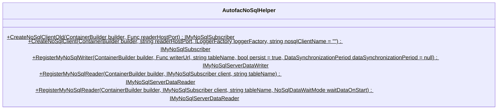

<div id="MyNoSqlSubscriberLogWrapper.DeleteActionsWrapper&lt;T&gt;-class-diagram"></div>

##### `MyNoSqlSubscriberLogWrapper.DeleteActionsWrapper<T>` class diagram

```mermaid
classDiagram
class DeleteActionsWrapper<T>{
    -string _name
    -string _tableName
    -Action<IEnumerable<(string partitionKey, string rowKey)>> _action
    +bool LogEnabled$
    +eActionsWrapper(string name, string tableName, Action<IEnumerable<(string partitionKey, string rowKey)>> action) void
    +Action(IEnumerable<(string partitionKey, string rowKey)> items) void
}

```

<div id="IMyNoSqlTcpClientManager-class-diagram"></div>

##### `IMyNoSqlTcpClientManager` class diagram

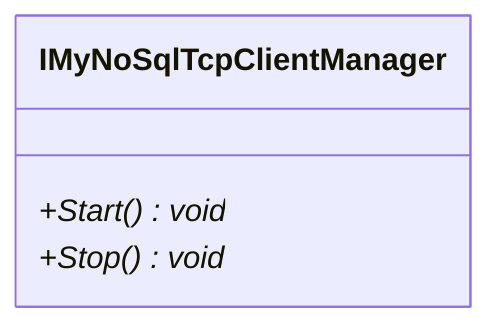

<div id="MyNoSqlSubscriberLogWrapper.InitActionWrapper&lt;T&gt;-class-diagram"></div>

##### `MyNoSqlSubscriberLogWrapper.InitActionWrapper<T>` class diagram

```mermaid
classDiagram
class InitActionWrapper<T>{
    -string _name
    -string _tableName
    -Action<IReadOnlyList<T>> _initAction
    +ctionWrapper(string name, string tableName, Action<IReadOnlyList<T>> initAction) void
    +Action(IReadOnlyList<T> items) void
}

```

<div id="MyNoSqlSubscriberLogWrapper.InitPartitionActionWrapper&lt;T&gt;-class-diagram"></div>

##### `MyNoSqlSubscriberLogWrapper.InitPartitionActionWrapper<T>` class diagram

```mermaid
classDiagram
class InitPartitionActionWrapper<T>{
    -string _name
    -string _tableName
    -Action<string, IReadOnlyList<T>> _action
    +artitionActionWrapper(string name, string tableName, Action<string, IReadOnlyList<T>> action) void
    +Action(string pk, IReadOnlyList<T> items) void
}

```

<div id="INoSqlReaderCountDataGetter-class-diagram"></div>

##### `INoSqlReaderCountDataGetter` class diagram

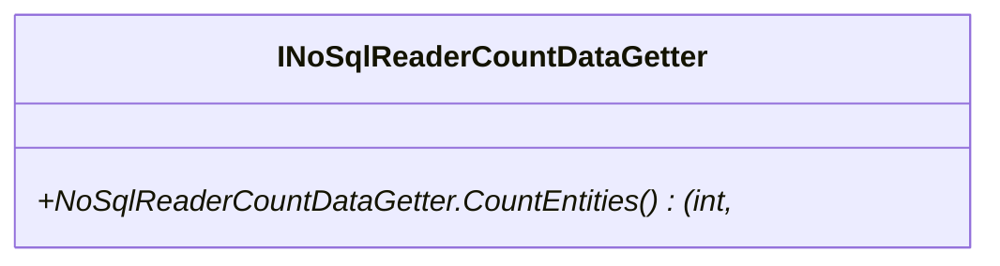

<div id="MyNoSqlClientLifeTime-class-diagram"></div>

##### `MyNoSqlClientLifeTime` class diagram

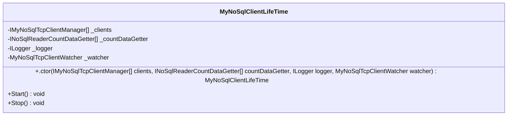

<div id="MyNoSqlSubscriberLogWrapper-class-diagram"></div>

##### `MyNoSqlSubscriberLogWrapper` class diagram

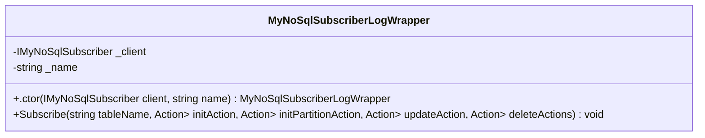

<div id="MyNoSqlTcpClientManager-class-diagram"></div>

##### `MyNoSqlTcpClientManager` class diagram

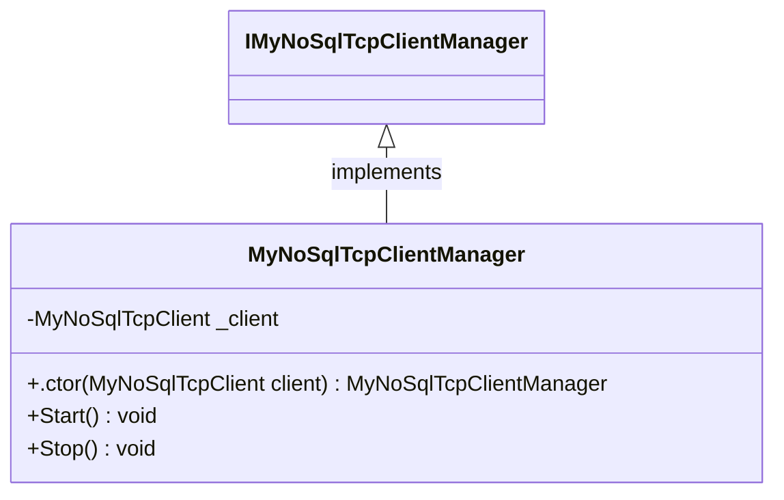

<div id="MyNoSqlTcpClientWatcher-class-diagram"></div>

##### `MyNoSqlTcpClientWatcher` class diagram

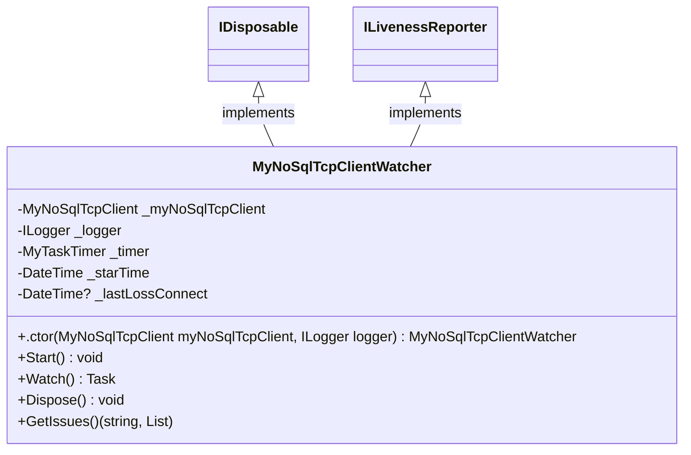

<div id="NoSqlDataWaitMode-class-diagram"></div>

##### `NoSqlDataWaitMode` class diagram

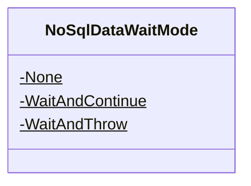

<div id="NoSqlReaderCountDataGetter-class-diagram"></div>

##### `NoSqlReaderCountDataGetter` class diagram

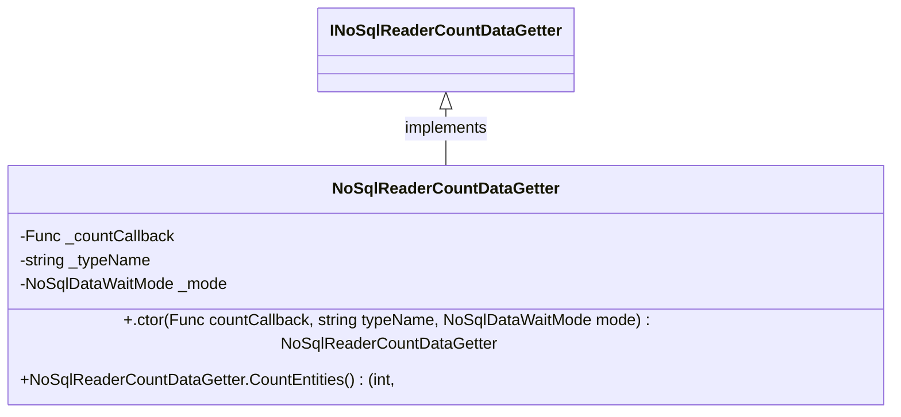

<div id="MyNoSqlSubscriberLogWrapper.UpdateActionWrapper&lt;T&gt;-class-diagram"></div>

##### `MyNoSqlSubscriberLogWrapper.UpdateActionWrapper<T>` class diagram

```mermaid
classDiagram
class UpdateActionWrapper<T>{
    -string _name
    -string _tableName
    -Action<IReadOnlyList<T>> _action
    +bool LogStartEnabled$
    +bool LogStopEnabled$
    +eActionWrapper(string name, string tableName, Action<IReadOnlyList<T>> action) void
    +Action(IReadOnlyList<T> items) void
}

```

<div id="Program-class-diagram"></div>

##### `Program` class diagram

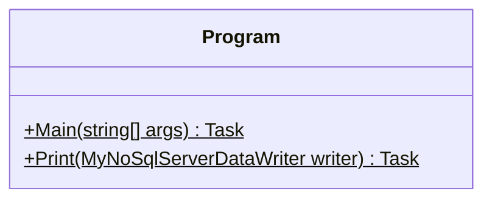

<div id="TestEntity-class-diagram"></div>

##### `TestEntity` class diagram

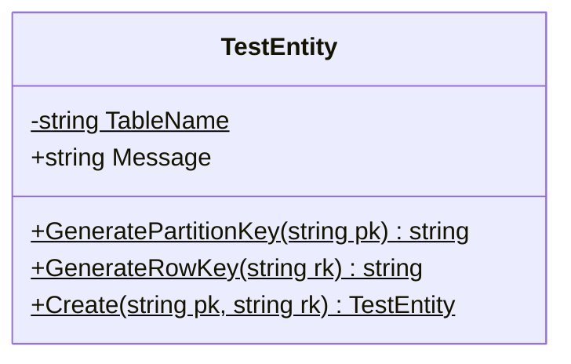

*This file is maintained by a bot.*

<!-- markdownlint-restore -->
